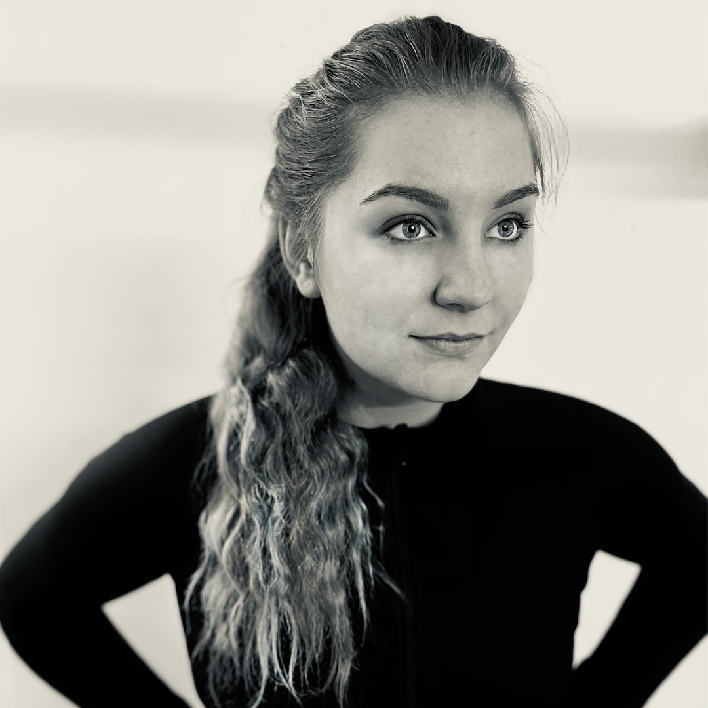

# Pavla Veverková
HEY! ARE YOU HERE? LISTEN! 
If you want...of course 🦖

## About Me
My artist way started when I was four. I was painting in a basic programme for Windows. That was Windows 2003, if I have good memories.

When I was in eighth class in primary school I started visiting artist course. There was the first step that get me to know what I want to be as an adult.

My high school was DUKE - Design and Art, Book Culture, and Economics Náhorní. They're my favourite teacher let me know, how is this job lovely. How you must be actual, but there is no problem using some elements from history. And how your first idea makes better!

Graphic designer...Wow! 
It sounds so nobly right? 
When I go with someone out a tell him, what I do, he is surprised. 

This job is about creativity, creating something from nothing, getting jokes and nice visuals to the world, it is a very fanny and inspired job.

Now I study Graphic design at VŠKK and work as a freelance designer. Create posts for social media,  logos and visuals, and illustrations.

In my free time I paint (oil, tempera, procreate app,..), but my favourite activities for spending time is jumping fitness (dynamic fitness activity with small trampolines, where you combination balance, jumping and sprint - it is like aerobic cardio on the trampoline for your better imagine).

If you are interested in and want you to see my work...

Here is it

