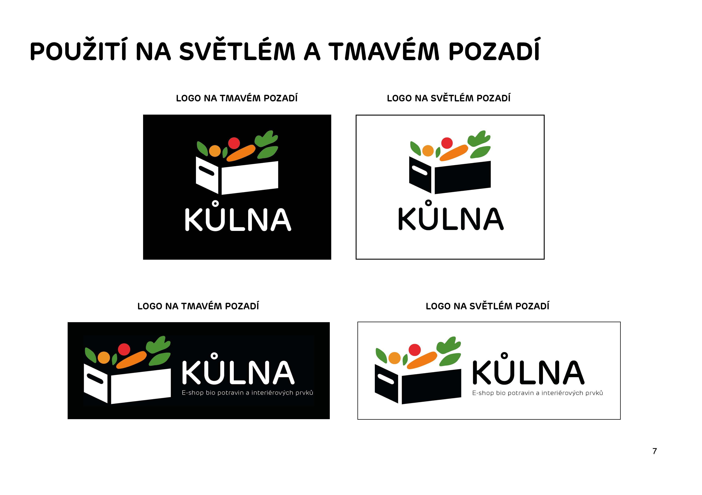

# Brief

# Logo for e-shop with bio product called Kůlna

## Description
I created the logo and logo manual for a new start-up with bio products and home-made decoration. 

## Action
For the logo and manual, I have five days. My client wants something basic, funny, and mainly with vegetables.  Ok, let's do it! 

I choose a variety of colours fresh vegetables and a dark contrast box. The next step was to make a manual for them.  Project Kůlna - how to work with logo ( no deform, size, symbol), which colours use, how logo gets to clothes, etc.

##Problem
Comes COVID-19 and nobody knows, what is it and how long will be there... So they end this startup and after saying that they had no money for my job. That wasn't nice...

This experience gets me to work on my portfolio and avoid for my next job "say about backup". 

